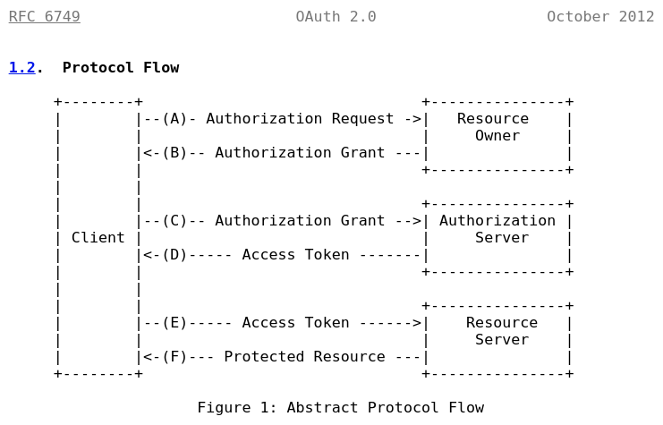
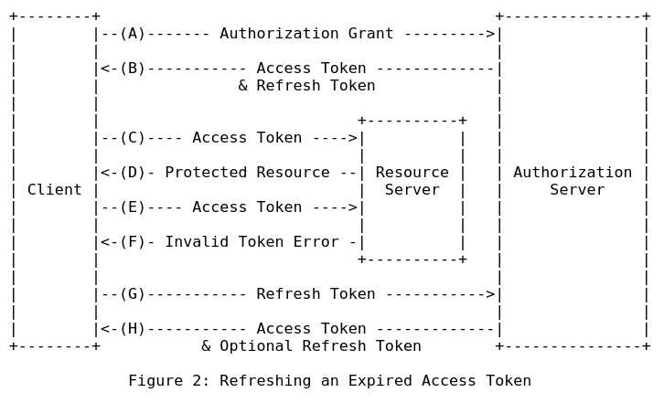

### Analysis of "The OAuth 2.0 Authorization Framework"
- https://datatracker.ietf.org/doc/html/rfc6749
  
- Abstract
    - A client webapp, written in AngularJs for example, requests a resource in the internet.
        - The resource may be represented by a REST endpoint in a quarkus Resource Server, for example.
    - The communication is done through HTTP requests that are sent by the client to a Resource Server or to the Authenticaion Server.
        - The Resource Server and the Authentication Server are two diferent instances in the oAuth2 authorization framework flow.
    - The client receives a limited access to this resource.
    - This limited access may be granted by the resource owner
    - Or by an interaction between the resource owner and the HTTP service.
        - The resource owner controls the resource represented in an endpoint.
        - And the HTTP Service represents the Resource Server services and the Authentication Server services which interact to create tokens to client authentication. 
- Problems of a traditional client-server authentication model:
    - The client requests an access-restricted resource (protected resource) on the server by authenticating with the server using the resource owner's credentials.
    - Resource Server and Client must have the resource owner's credentials.
    - Third-party applications are required to store the resource owner's credentials for future use, typically a password in clear-text.
    - In order to provide third-party applications access to restricted resources, the resource owner shares its credentials with the third party. Again, that can be a security problem.
    - Servers are required to support password authentication, despite the security weaknesses inherent in passwords.
    - Resource owners cannot revoke access to an individual third party without revoking access to all third parties, and must do so by changing the third party's password.
    - Compromise of any third-party application results in compromise of the end-user's password and all of the data protected by that password.
- Why should we use oAuth2?
    - OAuth uses a new layer for authorization: 
        - an Authorization Layer done by "access tokens".
    - OAuth separates the role of the client from that of the resource owner.
        - The Client doesn't receive Resource Owner exclusive credentials.
        - In OAuth, the client is issued a different set of credentials than those of the resource owner.
        - The client obtains an access token -- a string denoting a specific scope, lifetime, and other access attributes.
    - Oauth Authorization Layer is based on "Access Tokens"
        - An Authorization Server emits "Access Tokens" with the approval of the resource owner.  
        - The client uses the access token to access the protected resources hosted by the resource server.
    - Example that shows the Authorization Layer:
        - A resource owner can grant a AngularJs webapp (client) access to a REST Resource that is stored in a Resource Server, without sharing her username and password with the Resource Server or with the client. Only the "Authorization Server" knows username and password of users and of the aplications itself.
        - In session initialization, the user authenticates with the "Authorization Server" and receives an "access token".
        - And the Client (AngularJs webapp) begin to authenticate directly with a Resource Server trusted by Authorization Server. The Trusted Server issues the resource access through delegation-specific credentials (access token).
    - It is design to be used with HTTP protocol which is used by the majority of REST web servers.
- Roles:
    - resource owner
        - An entity capable of granting access to a protected resource. When the resource owner is a person, it is referred to as an end-user.
    - resource server
        - The server hosting the protected resources, capable of accepting and responding to protected resource requests using access tokens.
    - client
        - An application making protected resource requests on behalf of the resource owner and with its authorization.  The term "client" does not imply any particular implementation characteristics (e.g., whether the application executes on a server, a desktop, or other devices).
    - authorization server
        - The server issuing access tokens to the client after successfully authenticating the resource owner and obtaining authorization.
    - Obs.: 
        - It is important to understand the value of "Resource Owner" in the OAuth 2.0 Authorization framework.
        - The interaction between the authorization server and resource server is beyond the scope of this specification. The authorization server may be the same server as the resource server or a separate entity. A single authorization server may issue access tokens accepted by multiple resource servers.
- Protocol Flow
    - Abstract Protocol Flow  
    
    - Etapa Inicial A-1 (Client's Authorization Request)
        - The client (Browser or AngularJs app) requests some resource and the "OAuth 2.0 Authorization Framework flow" begins.
        - The client (Browser or AngularJs app) requests authorization from the resource owner. The authorization request can be made directly to the resource owner (as shown), or preferably indirectly via the authorization server as an intermediary.
            - Etapa A-2 (Authorization Request Processing)
                - The preferred method for the client to obtain an authorization grant from the resource owner is to use the authorization server as an intermediary.
                - If the Resource Server is the intermediary for the client request authorization, it must become a Trusted Server ***during this Protocol Flow***.
                - **Obs.: O Authorization Grant não é para o "Resource Server". O "Resource Server" já tem suas credencias no "client_id" e no "client_secret". Para solicitar o "client's Authorization Grant", o "Resource Server" sempre se autentica primeiro, com estas duas variáveis. Deve-se proteger com critografia e com requisição HTTPS, estas duas variáveis. De preferência, deve-se usar o POST para o fluxo de comunicação entre "Authentication Server" e "Resource Server", para o envio destas duas variáveis. O restante do fluxo é padronizado, conforme OAuth2. Não se deve inventar a roda e mudar a forma de autenticação do OAuth2. A única preocupação adicional de segurança, além de se seguir corretamente o padrão OAuth2, se encontra no armazenamento do "client_id" e do "client_secret". É inseguro deixar estas duas variáveis desprotegidas!**
                - To become a Trusted Server, the Resource Server requests authorization for an Anthorization Server.
                - Later, it starts to be a Trusted Server. But this information exists in the "Authorization Grant itself". The "Authorization Grant" shouldn't be recorded in the Trusted Server and it becames again a not-yet trusted server. It should always use the Authorization Server to became again a Trusted Server.
                - HTTP Communications for Authorization Request.
            - Etapa A-3
                - Resource Server or Authorization Server returns an Authorization Grant to the client.
        - **Teste: verificar no RESPONSE a ser enviado para o cliente se há Authorization Grant. O endpoint do resource nem começou a ser processado ainda.***
    - Etapa B (Reception of Authorization Grant)
        - The client (Browser or AngularJs app) receives an authorization grant, which is a credential representing the resource owner's authorization, expressed using one of four grant types defined in this specification or using an extension grant type.  
            - Grant types defined in this specification:
                - Authorization Code
                - Implicit
                - Resource Owner Password Credentials
                - Client Credentials
            - The authorization grant type depends on the method used by the client to request authorization and the types supported by the authorization server.
        - **Observação: Neste momento, o client passou a ter "Authorization Grant". Não tem ainda "Access Token", mas já tem um identificador do "Resource Server" na sua sessão de requisição.***
    - Etapa C (Client requests "access token", sending its Authorization Grant)
        - The client requests an access token by authenticating with the authorization server and presenting the authorization grant.
    - Etapa D (Authorization server returns an Acess Token to the client)
        - The authorization server authenticates the client and validates the authorization grant, and if valid, issues an access token.
    - Etapa E (Client request a resource, with its acdess token)
        - **Observação: Apenas este momento, o client passou a ter "Access Token" para requisitar resources.**
        - The client requests the protected resource from the resource server and authenticates by presenting the "access token".
    - Etapa final F (Resource server serves the request)
        - The resource server validates the access token, and if valid, serves the request, giving the "resource" to the "client".
- Authorization Grant
    - **Obs.: Credencial de acesso fornecida ao** ***client*** **que possibilita a solicitação de** ***access token.***
    - An authorization grant is a credential representing the resource owner's authorization (to access its protected resources) used by the client to obtain an access token. 
    - This specification defines four grant types of Authorization Grant:
        - authorization code, **<--- Most Secure Choice**
        - implicit,
        - resource owner password credentials, and
        - client credentials.
    - Other types of Authorization Grant is permited, if an extensibility mechanism for defining additional types is used.
- Authorization Grant (Type: Authorization Code)  **<--- Most Secure Choice**
    - The authorization code is obtained by using an authorization server as an intermediary between the client and resource owner.
    - Instead of requesting authorization directly from the resource owner, the client directs the resource owner to an authorization server (via its user-agent as defined in [RFC2616]), which in turn directs the - The Resource Owner back to the client with the authorization code.
    - Before directing the resource owner back to the client with the authorization code, the authorization server authenticates the resource owner and obtains authorization.
    - Because the resource owner only authenticates with the authorization server, the resource owner's credentials are never shared with the client.
    - The authorization code provides a few important security benefits, such as the ability to authenticate the client, as well as the transmission of the access token directly to the client without passing it through the resource owner's user-agent and potentially exposing it to others, including the resource owner.
- Access Token
    - Access tokens are credentials used to access protected resources. 
    - An access token is a string representing an authorization issued to the client.
    - The string is usually opaque to the client.
    - Tokens represent specific scopes and durations of access, granted by the resource owner, and enforced by the resource server and authorization server.
    - The token may denote an identifier used to retrieve the authorization information or may self-contain the authorization information in a verifiable manner (i.e., a token string consisting of some data and a signature).
    - Additional authentication credentials, which are beyond the scope of this specification, may be required in order for the client to use a token.
    - The access token provides an abstraction layer, replacing different authorization constructs (e.g., username and password) with a single token understood by the resource server.
    - This abstraction enables issuing access tokens more restrictive than the authorization grant used to obtain them, as well as removing the resource server's need to understand a wide range of authentication methods.
    - Access tokens can have different formats, structures, and methods of utilization (e.g., cryptographic properties) based on the resource server security requirements.
    - Access token attributes and the methods used to access protected resources are beyond the scope of this specification and are defined by companion specifications such as [RFC6750].
- Refresh Token
    - Refresh tokens are credentials used to obtain access tokens.
    - Refresh tokens are issued to the client by the authorization server and are used to obtain a new access token when the current access token becomes invalid or expires, or to obtain additional access tokens with identical or narrower scope (access tokens may have a shorter lifetime and fewer permissions than authorized by the resource owner).
    - Issuing a refresh token is optional at the discretion of the authorization server.
    - If the authorization server issues a refresh token, it is included when issuing an access token (i.e., step (D) in Figure 1).
    - A refresh token is a string representing the authorization granted to the client by the resource owner.
    - The string is usually opaque to the client.
    - The token denotes an identifier used to retrieve the authorization information.
    - Unlike access tokens, refresh tokens are intended for use only with authorization servers and are never sent to resource servers.
- Refreshing an Expired Access Token
    - Communication Flow:
    
- TLS Version
    - Whenever Transport Layer Security (TLS) is used by this specification, the appropriate version (or versions) of TLS will vary over time, based on the widespread deployment and known security vulnerabilities.
    - At the time of this writing, TLS version 1.2 [RFC5246] is the most recent version, but has a very limited deployment base and might not be readily available for implementation.
    - TLS version 1.0 [RFC2246] is the most widely deployed version and will provide the broadest interoperability.
    - Implementations MAY also support additional transport-layer security mechanisms that meet their security requirements.
- HTTP Redirections
    - This specification makes extensive use of HTTP redirections, in which the client or the authorization server directs the resource owner's user-agent to another destination.
    - While the examples in this specification show the use of the ***HTTP 302 status code***, any other method available via the user-agent to accomplish this redirection is allowed and is considered to be an implementation detail.
- Interoperability
    - OAuth 2.0 provides a rich authorization framework with well-defined security properties.
    - However, as a rich and highly extensible framework with many optional components, on its own, this specification is likely to produce a wide range of non-interoperable implementations.
    - In addition, this specification leaves a few required components partially or fully undefined (e.g., client registration, authorization server capabilities, endpoint discovery).
    - Without these components, clients must be manually and specifically configured against a specific authorization server and resource server in order to interoperate.
    - This framework was designed with the clear expectation that future work will define prescriptive profiles and extensions necessary to achieve full web-scale interoperability.
- Client Registration
    - Before initiating the protocol, the client registers with the authorization server.
    - The means through which the client registers with the authorization server are beyond the scope of this specification but typically involve end-user interaction with an HTML registration form.
    - Client registration does not require a direct interaction between the client and the authorization server.
    - When supported by the authorization server, registration can rely on other means for establishing trust and obtaining the required client properties (e.g., redirection URI, client type).
    - For example, registration can be accomplished using a self-issued or third-party-issued assertion, or by the authorization server performing client discovery using a trusted channel.
    - When registering a client, the client developer SHALL:
        - specify the client type as described in Section 2.1,
        - provide its client redirection URIs as described in Section 3.1.2, and
        - include any other information required by the authorization server (e.g., application name, website, description, logo image, the acceptance of legal terms).
- Client Types
    - OAuth defines two client types, based on their ability to authenticate securely with the authorization server (i.e., ability to maintain the confidentiality of their client credentials):
    - confidential
        - Clients capable of maintaining the confidentiality of their credentials (e.g., client implemented on a secure server with restricted access to the client credentials), or capable of secure client authentication using other means.
    - public
        - Clients incapable of maintaining the confidentiality of their credentials (e.g., clients executing on the device used by the resource owner, such as an installed native application or a web browser-based application), and incapable of secure client authentication via any other means.
    - The client type designation is based on the authorization server's definition of secure authentication and its acceptable exposure levels of client credentials. The authorization server SHOULD NOT make assumptions about the client type.
    - A client may be implemented as a distributed set of components, each with a different client type and security context (e.g., a distributed client with both a confidential server-based component and a public browser-based component). If the authorization server does not provide support for such clients or does not provide guidance with regard to their registration, the client SHOULD register each component as a separate client.
    - This specification has been designed around the following client profiles:
        - web application
            - A web application is a confidential client running on a web server.
            - Resource owners access the client via an HTML user interface rendered in a user-agent on the device used by the resource owner.
            - The client credentials as well as any access token issued to the client are stored on the web server and are not exposed to or accessible by the resource owner.
        - user-agent-based application  ** < --- **
            - A user-agent-based application is a public client in which the client code is downloaded from a web server and executes within a user-agent (e.g., web browser) on the device used by the resource owner.
            - Protocol data and credentials are easily accessible (and often visible) to the resource owner.
            - Since such applications reside within the user-agent, they can make seamless use of the user-agent capabilities when requesting authorization.
        - Native Application
            - A native application is a public client installed and executed on the device used by the resource owner.
            - Protocol data and credentials are accessible to the resource owner.
            - It is assumed that any client authentication credentials included in the application can be extracted.
            - On the other hand, dynamically issued credentials such as access tokens or refresh tokens can receive an acceptable level of protection.
            - At a minimum, these credentials are protected from hostile servers with which the application may interact.
            - On some platforms, these credentials might be protected from other applications residing on the same device.

        