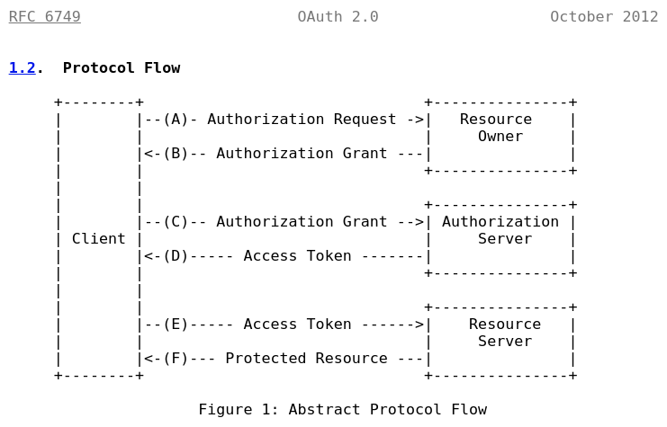

### Analysis of "The OAuth 2.0 Authorization Framework"
- https://datatracker.ietf.org/doc/html/rfc6749
  
- Abstract
    - A client webapp, written in AngularJs for example, requests a resource in the internet.
        - The resource may be represented by a REST endpoint in a quarkus Resource Server, for example.
    - The communication is done through HTTP requests that are sent by the client to a Resource Server or to the Authenticaion Server.
        - The Resource Server and the Authentication Server are two diferent instances in the oAuth2 authorization framework flow.
    - The client receives a limited access to this resource.
    - This limited access may be granted by the resource owner
    - Or by an interaction between the resource owner and the HTTP service.
        - The resource owner controls the resource represented in an endpoint.
        - And the HTTP Service represents the Resource Server services and the Authentication Server services which interact to create tokens to client authentication. 
- Problems of a traditional client-server authentication model:
    - The client requests an access-restricted resource (protected resource) on the server by authenticating with the server using the resource owner's credentials.
    - Resource Server and Client must have the resource owner's credentials.
    - Third-party applications are required to store the resource owner's credentials for future use, typically a password in clear-text.
    - In order to provide third-party applications access to restricted resources, the resource owner shares its credentials with the third party. Again, that can be a security problem.
    - Servers are required to support password authentication, despite the security weaknesses inherent in passwords.
    - Resource owners cannot revoke access to an individual third party without revoking access to all third parties, and must do so by changing the third party's password.
    - Compromise of any third-party application results in compromise of the end-user's password and all of the data protected by that password.
- Why should we use oAuth2?
    - OAuth uses a new layer for authorization: 
        - an Authorization Layer done by "access tokens".
    - OAuth separates the role of the client from that of the resource owner.
        - The Client doesn't receive Resource Owner exclusive credentials.
        - In OAuth, the client is issued a different set of credentials than those of the resource owner.
        - The client obtains an access token -- a string denoting a specific scope, lifetime, and other access attributes.
    - Oauth Authorization Layer is based on "Access Tokens"
        - An Authorization Server emits "Access Tokens" with the approval of the resource owner.  
        - The client uses the access token to access the protected resources hosted by the resource server.
    - Example that shows the Authorization Layer:
        - A resource owner can grant a AngularJs webapp (client) access to a REST Resource that is stored in a Resource Server, without sharing her username and password with the Resource Server or with the client. Only the "Authorization Server" knows username and password of users and of the aplications itself.
        - In session initialization, the user authenticates with the "Authorization Server" and receives an "access token".
        - And the Client (AngularJs webapp) begin to authenticate directly with a Resource Server trusted by Authorization Server. The Trusted Server issues the resource access through delegation-specific credentials (access token).
    - It is design to be used with HTTP protocol which is used by the majority of REST web servers.
- Roles:
    - resource owner
        - An entity capable of granting access to a protected resource. When the resource owner is a person, it is referred to as an end-user.
    - resource server
        - The server hosting the protected resources, capable of accepting and responding to protected resource requests using access tokens.
    - client
        - An application making protected resource requests on behalf of the resource owner and with its authorization.  The term "client" does not imply any particular implementation characteristics (e.g., whether the application executes on a server, a desktop, or other devices).
    - authorization server
        - The server issuing access tokens to the client after successfully authenticating the resource owner and obtaining authorization.
    - Obs.: 
        - It is important to understand the value of "Resource Owner" in the OAuth 2.0 Authorization framework.
        - The interaction between the authorization server and resource server is beyond the scope of this specification. The authorization server may be the same server as the resource server or a separate entity. A single authorization server may issue access tokens accepted by multiple resource servers.
- Protocol Flow
    - Abstract Protocol Flow  
    
    - Etapa Inicial A-1 (Client's Authorization Request)
        - The client (Browser or AngularJs app) requests some resource and the "OAuth 2.0 Authorization Framework flow" begins.
        - The client (Browser or AngularJs app) requests authorization from the resource owner. The authorization request can be made directly to the resource owner (as shown), or preferably indirectly via the authorization server as an intermediary.
            - Etapa A-2 (Authorization Request Processing)
                - The preferred method for the client to obtain an authorization grant from the resource owner is to use the authorization server as an intermediary.
                - If the Resource Server is the intermediary for the client request authorization, it must become a Trusted Server ***during this Protocol Flow***.
                - **Obs.: O Authorization Grant não é para o server. O server já tem suas credencias no "client_id" e no "client_secret". Para solicitar o "client's Authorization Grant", o resource Server sempre se autentica primeiro, com estas duas variáveis. Deve-se proteger com critografia e com requisição HTTPS, estas duas variáveis. De preferência, deve-se usar o POST para o fluxo de comunicação entre "Authentication Server" e "Resource Server", para o envio destas duas variáveis. O restante do fluxo é padronizado, conforme OAuth2. Não se deve inventar a roda e mudar a forma de autenticação do OAuth2. A única preocupação adicional de segurança, além de se seguir o padrão OAuth2, se encontra no armazenamento do "client_id" e do "client_secret".**
                - To become a Trusted Server, the Resource Server requests authorization for an Anthorization Server.
                - Later, it starts to be a trusted server.
                - HTTP Communications for Authorization Request.
            - Etapa A-3
                - Resource Server or Authorization Server returns an Authorization Grant to the client.
        - **Teste: verificar no RESPONSE a ser enviado para o cliente se há Authorization Grant. O endpoint do resource nen começou a ser processado ainda.***
    - Etapa B (Reception of Authorization Grant)
        - The client (Browser or AngularJs app) receives an authorization grant, which is a credential representing the resource owner's authorization, expressed using one of four grant types defined in this specification or using an extension grant type.  
            - Grant types defined in this specification:
                - Authorization Code
                - Implicit
                - Resource Owner Password Credentials
                - Client Credentials
            - The authorization grant type depends on the method used by the client to request authorization and the types supported by the authorization server.
        - **Observação: Neste momento, o client passou a ter "Authorization Grant". Não tem ainda "Access Token", mas já tem um identificador do "Resource Server" na sua sessão de requisição.***
    - Etapa C (Client requests "access token", sending its Authorization Grant)
        - The client requests an access token by authenticating with the authorization server and presenting the authorization grant.
    - Etapa D (Authorization server returns an Acess Token to the client)
        - The authorization server authenticates the client and validates the authorization grant, and if valid, issues an access token.
    - Etapa E (Client request a resource, with its acdess token)
        - **Observação: Apenas este momento, o client passou a ter "Access Token" para requisitar resources.***
        -   (E)  The client requests the protected resource from the resource server and authenticates by presenting the access token.
    - Etapa final F (Resource server serves the request)
        - The resource server validates the access token, and if valid, serves the request.

